# 📄 Documentation for MY Portfolio

## 📑 Index

1. <a href="#-introduction">Introduction</a>
1. <a href="#-file-overview">File Overview</a>
1. <a href="#indexcss">index.css</a>
    1. <a href="#global-css-variables">Global CSS Variables</a>
    1. <a href="#base--utility-styles">Base &amp; Utility Styles</a>
    1. <a href="#component-styles">Component Styles</a>
    1. <a href="#responsive-design">Responsive Design</a>
1. <a href="#indexhtml">index.html</a>
    1. <a href="#head-section">Head Section</a>
    1. <a href="#body-structure">Body Structure</a>
1. <a href="#readmemd">README.md</a>
1. <a href="#page-flow-diagram">Page Flow Diagram</a>
1. <a href="#notes--recommendations">Notes &amp; Recommendations</a>

---

## 🌟 Introduction

This documentation covers a single-page portfolio website for Harold Safary, showcasing his expertise in cybersecurity and space weather analysis. The project is built with pure HTML and CSS, featuring:

- A fullscreen video background
- A sticky glassmorphic header &amp; responsive navigation
- Animated hero, about, skills, portfolio, and contact sections
- Theme managed via CSS custom properties

---

## 📂 File Overview

| Filename | Description |
| --- | --- |
| index.css | Stylesheet defining theme, layout, components &amp; responsiveness. |
| index.html | HTML markup for the portfolio: sections, navigation &amp; content. |
| README.md | Project title placeholder (minimal content). |

---

## 🎨 index.css

### 🌐 Global CSS Variables

Defines the site’s color palette, fonts, and theme tokens.

| Variable | Value | Description |
| --- | --- | --- |
| <code>--primary-glow</code> | <code>#00bfff</code> | Deep Sky Blue accent |
| <code>--secondary-glow</code> | <code>#9400d3</code> | Dark Violet accent |
| <code>--background-dark</code> | <code>#02001a</code> | Page background |
| <code>--glass-bg</code> | <code>rgba(10, 10, 30, 0.5)</code> | Semi-transparent glass effect |
| <code>--text-color</code> | <code>#d0d0d0</code> | Standard text color |
| <code>--text-bright</code> | <code>#ffffff</code> | Bright (headings, highlights) |
| <code>--font-primary</code> | <code>'Orbitron', sans-serif</code> | Headline font |
| <code>--font-secondary</code> | <code>'Roboto Mono', monospace</code> | Body &amp; UI font |

```css
:root {
  --primary-glow: #00bfff;
  --secondary-glow: #9400d3;
  /* ... other vars ... */
  --font-secondary: 'Roboto Mono', monospace;
}
```

---

### 🔧 Base &amp; Utility Styles

- Reset &amp; Box Model

```css
  * { margin: 0; padding: 0; box-sizing: border-box; }
  html { scroll-behavior: smooth; }
```

- Typography &amp; Layout

```css
  body {
    font-family: var(--font-secondary);
    background-color: var(--background-dark);
    color: var(--text-color);
    overflow-x: hidden;
  }
  .container {
    max-width: 1200px;
    margin: 0 auto;
    padding: 0 2rem;
  }
  .content-section {
    padding: 6rem 0;
  }
```

---

### 🧩 Component Styles

#### 1. Video Background

```css
.video-background {
  position: fixed; top: 0; left: 0;
  width: 100%; height: 100%;
  z-index: -2; overflow: hidden;
}
.video-background::after {
  content: '';
  position: absolute; inset: 0;
  background: radial-gradient(
    ellipse at center,
    rgba(2,0,26,0.6) 0%,
    rgba(2,0,26,0.9) 100%
  );
  z-index: -1;
}
#bg-video { object-fit: cover; width:100%; height:100%; }
```

#### 2. Header &amp; Navigation

```css
header {
  position: sticky; top: 0; z-index: 100;
  background: var(--glass-bg);
  backdrop-filter: blur(10px);
  border-bottom: 1px solid rgba(0,191,255,0.2);
}
.page-header { display: flex; justify-content: space-between; align-items: center; }
.logo a { /* glowing text */ }
ul {
  display: flex; gap: .8rem; list-style: none;
}
/* Active & Hover */
li a:hover, li a.active {
  background: rgba(0,191,255,0.15);
  box-shadow: 0 0 15px rgba(0,191,255,0.3);
  color: var(--text-bright);
}
```

#### 3. Hero Section

```css
.hero { min-height: 90vh; display: flex; align-items: center; }
.hero-content {
  display: grid; grid-template-columns: 1fr 1fr; gap: 4rem;
  animation: fadeIn 1.5s ease-out;
}
/* Call-to-Action Button */
.cta-button {
  background: var(--primary-glow);
  color: var(--background-dark);
  padding: .8rem 2rem; border-radius: 5px;
  transition: .3s;
}
.cta-button:hover {
  background: transparent;
  box-shadow: 0 0 20px var(--primary-glow);
}
```

#### 4. Cards (Skills &amp; Portfolio)

```css
.card, .portfolio-card {
  background: var(--glass-bg); backdrop-filter: blur(10px);
  border: 1px solid rgba(0,191,255,0.2);
  border-radius: 10px; transition: transform .3s, box-shadow .3s;
}
.card:hover, .portfolio-card:hover {
  transform: translateY(-10px);
  box-shadow: 0 10px 30px rgba(0,191,255,0.2);
}
```

#### 5. Contact &amp; Footer

```css
.contact-links a:hover {
  color: var(--primary-glow);
  transform: scale(1.1);
  text-shadow: 0 0 15px var(--primary-glow);
}
footer {
  text-align: center;
  padding: 2rem 0;
  border-top: 1px solid rgba(0,191,255,0.1);
}
```

---

### 📱 Responsive Design

Adapts layout for tablets and mobiles via media queries at 992px and 768px.

| Breakpoint | Adjustments |
| --- | --- |
| max-width: 992px | Stacks <code>.hero-content</code> into a single column, adjusts images and text order. |
| max-width: 768px | Converts nav links into a full-screen vertical menu, toggled by a hamburger icon. |

```css
@media screen and (max-width: 768px) {
  ul { position: fixed; left: -100%; /* hides the menu */ }
  #click:checked ~ ul { left: 0; /* shows on toggle */ }
  .menu { display: block; }
}
```

---

## 🏗️ index.html

### 📝 Head Section

```html
<head>
  <meta charset="UTF-8">
  <meta name="viewport" content="width=device-width, initial-scale=1.0">
  <link rel="stylesheet" href="https://cdnjs.cloudflare.com/.../font-awesome.min.css">
  <link rel="stylesheet" href="index.css">
  <title>Harold Safary | Cybersecurity & Space Weather Analyst</title>
</head>
```

- Imports Font Awesome for icons
- Links to index.css
- Sets viewport for responsive behavior

---

### 🏷️ Body Structure

The page is structured into seven main parts:

| Section | HTML ID/Class | Purpose |
| --- | --- | --- |
| Video Background | <code>.video-background</code> | Fullscreen looping background video with overlay gradient. |
| Header &amp; Nav | <code></code><code></code> / <code>ul</code> | Sticky glassmorphic navbar with hamburger menu on mobile. |
| Hero | <code>#home .hero</code> | Introductory call-to-action with animated headline &amp; image. |
| About | <code>#about</code> | Personal bio and background description. |
| Skills | <code>#skills</code> | Cards listing core expertise (Cybersecurity, Fortran, etc.). |
| Portfolio | <code>#portfolio</code> | Showcase of major project with image, description &amp; links. |
| Contact | <code>#contact</code> | Social/contact icons for email, LinkedIn, GitHub. |
| Footer | <code></code><code></code> | Copyright notice. |

#### Example: Hero Section Markup

```html
<section class="container hero" id="home">
  <div class="hero-content">
    <div class="text-content">
      <h3>Cybersecurity Analyst & Space Weather Specialist</h3>
      <h1>Forging Digital <span class="highlight">Frontiers</span></h1>
      <p>...</p>
      <a href="#contact" class="cta-button">Engage Mission</a>
    </div>
    <div class="image-content">
      
    </div>
  </div>
</section>
```

---

## 📖 README.md

> Filename: <code>README.md</code>
Content:

```markdown
# Deadpool1997.github.io Portfolio
```

- Acts as a placeholder or title for GitHub Pages deployment.
- Can be expanded with project overview, installation steps, or contribution guidelines.

---

## 🌐 Page Flow Diagram

```mermaid
flowchart TD
  A[Header 🔗] --> B[Hero 🎯]
  B --> C[About 👤]
  C --> D[Skills 🛠️]
  D --> E[Portfolio 📁]
  E --> F[Contact ✉️]
  F --> G[Footer ©]
```



Visual representation of the page’s vertical section flow.

---

## 📝 Notes &amp; Recommendations

- Accessibility:
    - Add <code>aria-label</code> to the hamburger <code></code> and improved alt texts.
    - Ensure color contrast meets WCAG for readability.
- Performance:
    - Lazy-load non-critical images or videos to reduce initial load.
    - Consider serving a poster image for the video fallback.
- SEO &amp; Metadata:
    - Populate <code></code> and Open Graph tags.
- Further Enhancements:
    - Expand README.md with setup/deployment instructions.
    - Introduce a simple JS snippet for smooth scroll or active link highlighting.

---

End of Documentation
